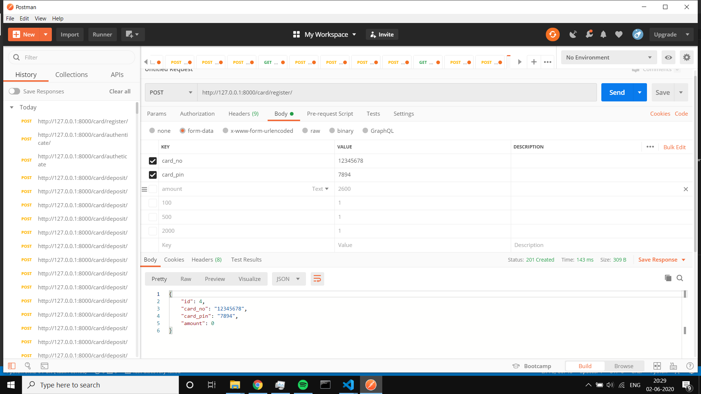

# Mckinley_Task
ATM Rest APIs built using Django Rest Framework

## APIs 

* http://127.0.0.1:8000/card/register/ (POST)

* http://127.0.0.1:8000/card/authenticate/ (POST)

* http://127.0.0.1:8000/card/deposit/ (POST)

* http://127.0.0.1:8000/card/withdraw/ (POST)
